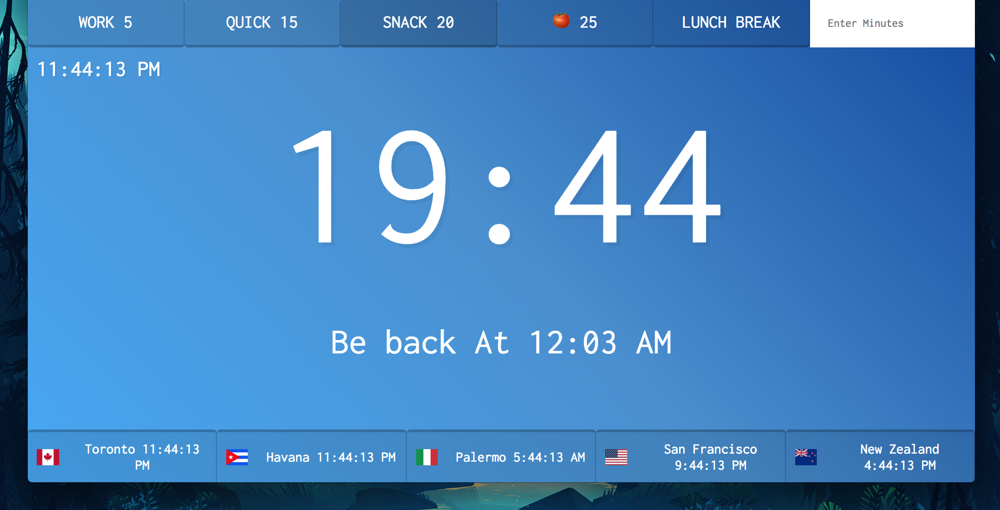

### countdown-clock

Built based on Lesson #29 of [Javascript30](https://javascript30.com/)

Check it out [here](http://countdown-clock.surge.sh)

Added the timezones to track my family timezones

<div align="center">

</div>

---

If you keep the same structure you could change thse values to add more timezones or counters: 
* `data-time` = most be in seconds (ex: 5 mins will be 5x60=300) => find the correct timer
* `data-city` = could be anything (it will show on the lower bar)
* `data-country` = ISO Alpha 2 Code, search here [link](http://www.nationsonline.org/oneworld/country_code_list.htm) => find the correct flag
* `data-utc` = UTC Code, search here [link](https://www.timeanddate.com/worldclock/timezone/utc) => find the correct UTC timezone


For example you could add a new timer and timezone like this:
```html
<button data-time="1800" class="timer__button">30 minutes</button>
<div data-city="Paris" data-country="fr" data-utc="1"></div>
```

<div align="left">


</div> 